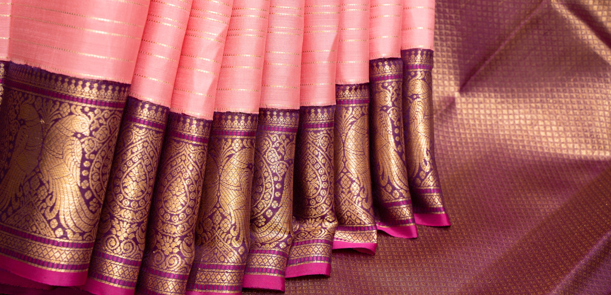
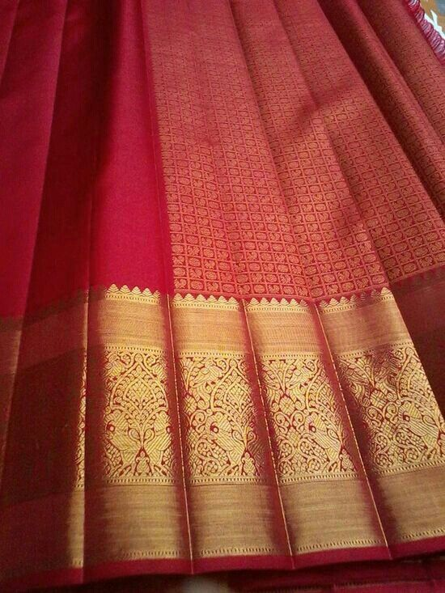

<!DOCTYPE html>
<html lang="en">
<head>
    <meta charset="UTF-8">
    <meta name="viewport" content="width=device-width, initial-scale=1.0">
    <title>Loom Saree Store</title>
    
</head>
<body>
    <header class="header">
        
LOOM SAREE STORE

        

            

            

            

        

        <nav class="nav-links">
            <a href="#home" onclick="scrollToSection(event, 'home')">Home</a>
            <a href="#shop" onclick="scrollToSection(event, 'shop')">Shop</a>
            <a href="#about" onclick="scrollToSection(event, 'about')">About Us</a>
            <a href="#contact" onclick="scrollToSection(event, 'contact')">Contact</a>
        </nav>
    </header>

    <main class="main-content" id="home">
        <h1>Welcome to Our Loom Saree Store</h1>
        

            
            <h3>saree no-1</h3>
            
$2000

            <button class="buy-now-btn" onclick="openModal('Product 1', 29.99)">Buy Now</button>
        

        

            
            <h3>saree no-2</h3>
            
$2000

            <button class="buy-now-btn" onclick="openModal('Product 2', 39.99)">Buy Now</button>
        

        <!-- Add more products as needed -->
    </main>

    <section id="about" class="section">
        <h2>About Us</h2>
        
Welcome to our Loom Saree Store! We are passionate about providing high-quality, fashionable saree's at affordable prices. Our goal is to offer a wide range of products that cater to all styles and preferences. Our dedicated team works hard to ensure that every item in our store meets the highest standards of quality and design. Thank you for choosing us for your fashion needs!

    </section>

    <section id="contact" class="section">
        <h2>Contact Us</h2>
        
If you have any questions, feedback, or inquiries, please feel free to reach out to us. You can contact us via email at <a href="simhamkumar9949@gmail.com">simhamkumar9949@gmail.com</a> or call us at +91 8309902307/994920365. We look forward to hearing from you and assisting you with any concerns you may have.

    </section>

    <!-- Modal -->
    

        

            <button class="close" onclick="closeModal()">Close</button>
            <h2>Order Form</h2>
            <form action="https://formspree.io/f/mjkbzlrg" method="POST" id="orderForm">
                <input type="hidden" id="productName" name="productName">
                <input type="hidden" id="productPrice" name="productPrice">
                <label for="name">Name:</label>
                <input type="text" id="name" name="name" required>
                <label for="address">Address:</label>
                <textarea id="address" name="address" required></textarea>
                <label for="mobile">Mobile Number:</label>
                <input type="tel" id="mobile" name="mobile" required>
                <label for="quantity">Quantity:</label>
                <input type="number" id="quantity" name="quantity" min="1" required>
                <label for="saree number">saree number</label>
                <input type="number" id="saree number" name="saree number" min="1" required>
                <button type="submit">Submit Order</button>
            </form>
        

    

    
</body>
</html>
